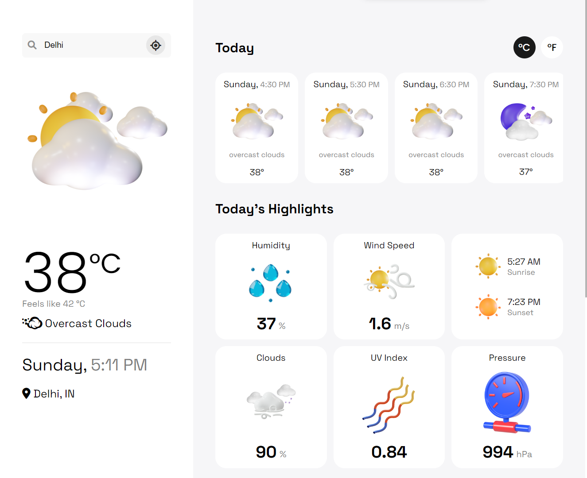

# Weather Application

    <b></b>

Welcome to the Weather Application! This app allows users to input a city name and promptly displays weather details for the selected city.

## Features

- **City Search:** Users can input their desired city name.
- **Real-Time Weather Details:** Displays temperature, humidity, pressure, wind speed, and more for the selected city.
- **User-Friendly Interface:** Provides an intuitive interface for ease of use.

## Technologies Used

- **Frontend:** HTML, CSS, JavaScript
- **Backend:** APIs to fetch weather data (e.g., OpenWeatherMap API)
- **Data Presentation:** Displaying fetched data in a user-friendly format on the application interface.

## Usage

1. **Input City Name:** Type the name of the city you want to get weather details for into the search box.
2. **Retrieve Weather Details:** Once the city name is entered, the system promptly displays weather information for the selected city.

## Getting Started

To run the Weather Application:

1. Clone the repository: `git clone https://github.com/mrityunjaykumar9/weather_app.git`
2. Set up API keys: If necessary, acquire and configure API keys for weather data retrieval.

## Acknowledgements

- This project was inspired by Prof Prasant singh.
- Special thanks to prof Amritpal singh for their valuable contributions.

## Contact

For inquiries or support, contact mrityunjaykumar579@gmail.com.

## **Thank You! ❣️**